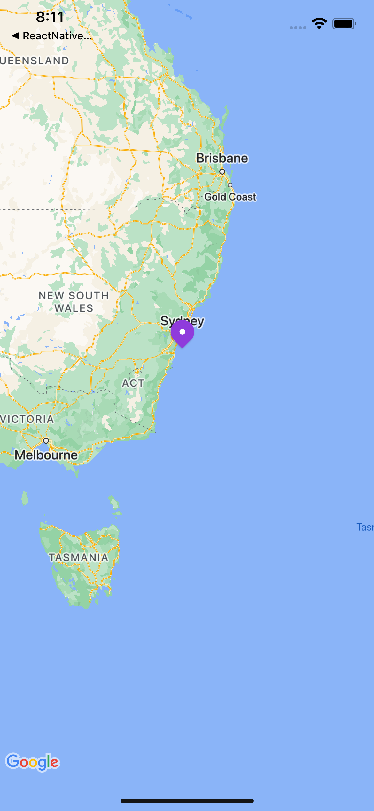
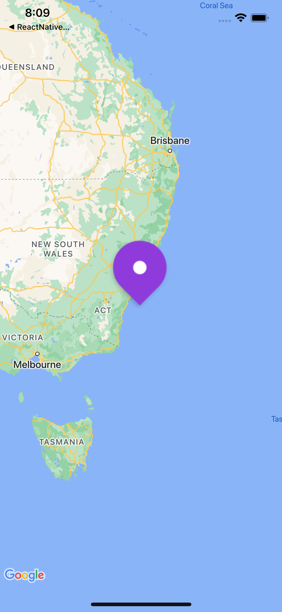

# Gotoshisha - React Native マップアプリケーション

このプロジェクトは、Expo と React Native Maps を使用した React Native アプリケーションで、Hono + Cloudflare Workers で構築されたバックエンド API を持っています。

## プロジェクト構成

- **フロントエンド**: React Native + Expo + TypeScript
- **バックエンド**: Hono + Cloudflare Workers + D1 Database + Prisma
- **テスト**: フロントエンドとバックエンドの両方で Vitest を使用
- **リンティング**: TypeScript サポート付き ESLint
- **CI/CD**: 自動テストとリンティングのための GitHub Actions

## 開発環境のセットアップ

### 前提条件

- Node.js 20+
- pnpm パッケージマネージャー
- Expo CLI

### フロントエンドのセットアップ

1. 依存関係をインストール:

   ```bash
   pnpm install
   ```

2. 開発サーバーを起動:

   ```bash
   pnpm start
   # または iOS の場合
   pnpm ios
   # または Android の場合
   pnpm android
   ```

3. トンネルモード（テスト推奨）:
   ```bash
   pnpm start:clear
   ```

### バックエンドのセットアップ

1. バックエンドディレクトリに移動:

   ```bash
   cd backend
   ```

2. 依存関係をインストール:

   ```bash
   pnpm install
   ```

3. 環境変数を設定:

   ```bash
   cp .env.example .env
   ```

4. Prisma クライアントを生成:

   ```bash
   pnpm db:generate
   ```

5. 開発サーバーを起動:
   ```bash
   pnpm dev
   ```

## 利用可能なスクリプト

### フロントエンドスクリプト

- `pnpm start` - Expo 開発サーバーを起動
- `pnpm ios` - iOS シミュレーターを起動
- `pnpm android` - Android エミュレーターを起動
- `pnpm web` - Web 開発サーバーを起動
- `pnpm lint` - ESLint を実行
- `pnpm lint:fix` - ESLint の問題を自動修正
- `pnpm test` - ウォッチモードでテストを実行
- `pnpm test:run` - テストを一度実行
- `pnpm type-check` - TypeScript 型チェックを実行

### バックエンドスクリプト

- `pnpm dev` - Wrangler で開発サーバーを起動
- `pnpm build` - プロダクション用にビルド
- `pnpm deploy` - Cloudflare Workers にデプロイ
- `pnpm lint` - ESLint を実行
- `pnpm test:run` - テストを実行
- `pnpm db:generate` - Prisma クライアントを生成
- `pnpm db:push` - スキーマ変更をデータベースにプッシュ

## CI/CD

このプロジェクトは継続的インテグレーションのために GitHub Actions を使用しています。CI パイプラインには以下が含まれます：

### フロントエンド CI

- TypeScript 型チェック
- ESLint リンティング
- Vitest ユニットテスト

### バックエンド CI

- Prisma クライアント生成
- TypeScript 型チェック
- ESLint リンティング
- Vitest ユニットテスト

### ビルドチェック

- バックエンドビルド検証
- Expo Web エクスポート検証

CI は以下の場合に実行されます：

- `main` および `develop` ブランチへのプッシュ
- `main` および `develop` ブランチへのプルリクエスト

## テスト

### テストの実行

```bash
# フロントエンドテスト
pnpm test:run

# バックエンドテスト
cd backend && pnpm test:run

# 全テスト（ルートから）
pnpm test:run
```

### テスト構造

- フロントエンドテストは `src/` ディレクトリ内のソースファイルと同じ場所に配置
- バックエンドテストは `backend/src/` ディレクトリ内に配置
- テストファイルは `*.test.ts` パターンに従う
- テストはプロジェクトガイドラインに従って日本語の説明で Vitest を使用

## コード品質

### リンティング

```bash
# フロントエンドリンティング
pnpm lint

# バックエンドリンティング
cd backend && pnpm lint

# リンティング問題の修正
pnpm lint:fix
```

### 型チェック

```bash
# フロントエンド型チェック
pnpm type-check

# バックエンド型チェック
cd backend && pnpm type-check
```

### 期待される結果



### 実際の結果

App.tsx でスタートアップ時に expo-asset を使用してアセットをキャッシュすることで、アセットバンドリングの結果をシミュレートしています。



### ローカルブランチの削除

```bash
git branch -vv | grep ': gone]' | awk '{print $1}' | while
```
